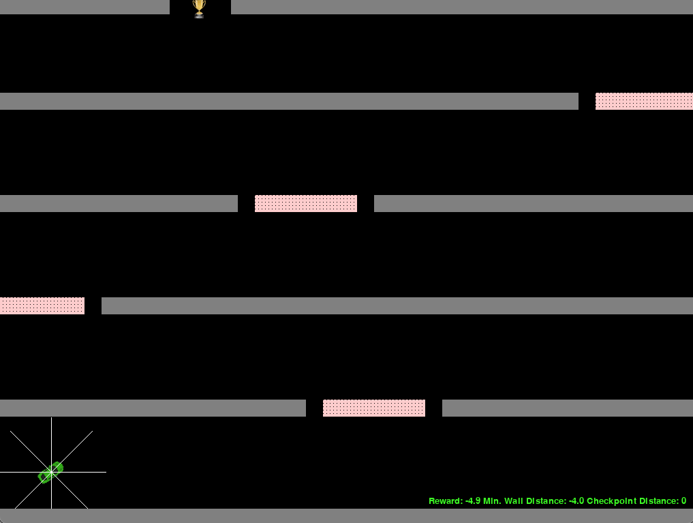
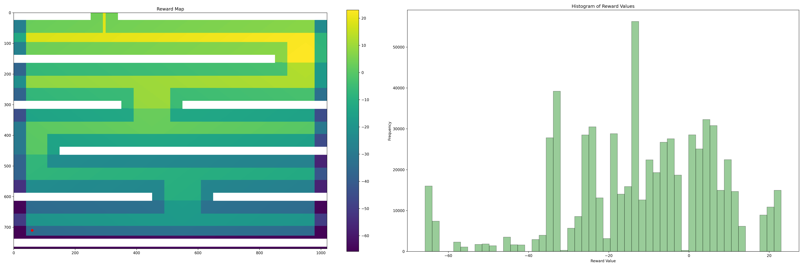

# RL_Race_Game

### The game

Reinforcement Learning on a 2D Python [Race Game](https://github.com/tdostilio/Race_Game). The game is essentially a maze for a small car that has to find the trophy.

    

        <figure style="width: 49%;">
            
            <figcaption>Race Game Screenshot</figcaption>
        </figure>
        <figure style="width: 49%;">
            
            <figcaption>RL Environment adaptation</figcaption>
        </figure>
    

I restructured the game into an openAI-gym by adding 1st person view for an agent (8 whiskers to measure distance to surrounding objects) and by designing a reward map to keep it away from walls and obstacles. This yielded 10 state observations (distances, car's speed, car's orientation) that were used to choose one of 5 actions (no action, left, right, forward, reverse). As I started with simple Qlearning to learn the basics and it was quite a challenge to get it to learn, I added checkpoints that would reward the agent once passed into the next "level". This led to a reward map and reward distribution like so:

<figure style="width: 100%; max-width: 1000px; margin: 20px auto;">
    
    <figcaption>Reward Map and Distribution</figcaption>
</figure>

Reward function design and agent strategy optimization require mutual optimization. I went through various stages of reward maps with different weights for distances to obstacles, distances to checkpoints and discrete "No-Go Areas".

### Qlearning

### Roadmap

* DeepQ or Policy-Gradient approaches via Neural Nets
* Add memory: LSTM-based or Replay Buffer
* Generalizability: Random level construction
* Top view: CNN-based architecture

### Sources

* [RaceGame by tdostilio](https://github.com/tdostilio/Race_Game)
* [Medium: Ultimate Guide to Reinforcement Learning Part 1 — Creating a Game](https://towardsdatascience.com/ultimate-guide-for-reinforced-learning-part-1-creating-a-game-956f1f2b0a91)
* [Python Programming Tutorial Series on Qlearning](https://pythonprogramming.net/q-learning-reinforcement-learning-python-tutorial/)

